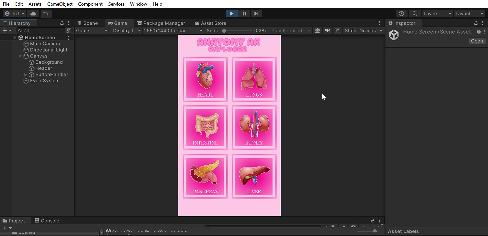
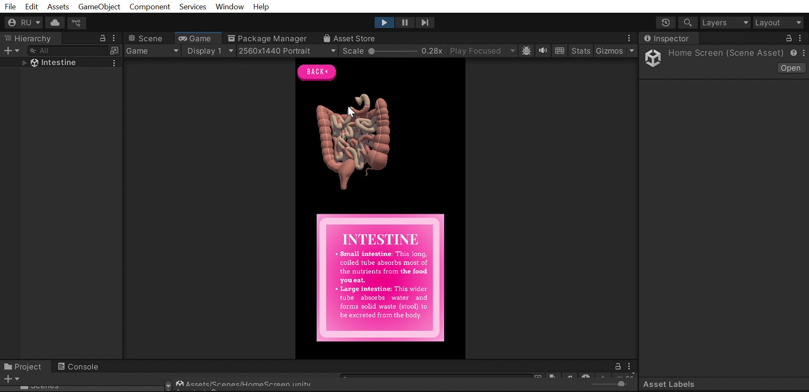

# AR Human Anatomy App

### Tools Used:
- **Unity 3D** – Used for building and developing the AR functionality.
- **Canva** – Used for button designing and layout.
- **Augmented Reality (AR) SDK** – Implemented for integrating AR features into the app.

### Description:
This app features Augmented Reality functionality, allowing users to interact with 3D models of human organs. The app provides auto-rotating 3D organs, with touch and mouse control for manual rotation, and a clean home screen with buttons to navigate through different organs.

### How to Run:
1. Clone the repository:
   ```bash
   git clone https://github.com/your-username/AR-Anatomy-App.git
## Home Scene

## Sample Scene


